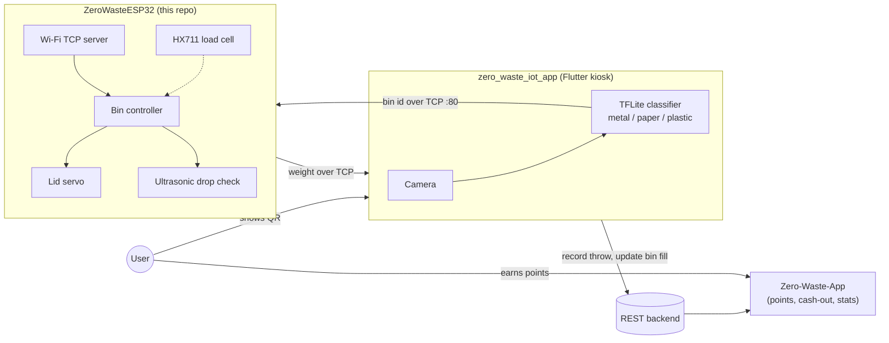
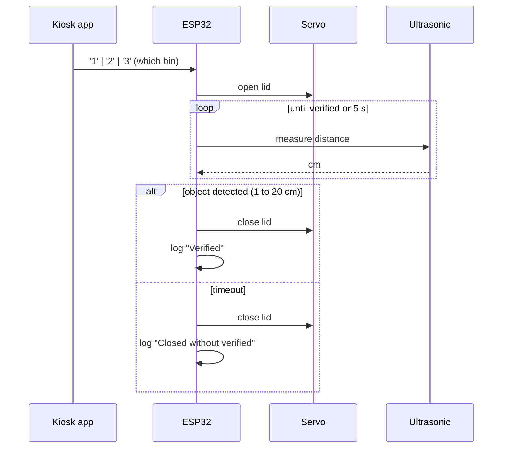

# ♻️ Zero Waste ESP32

**The embedded brain of a smart recycling bin: it opens the right lid, checks that the item was dropped in, and weighs it.**

This is the firmware for the hardware side of the **Zero Waste** ecosystem. A three-compartment bin (plastic / paper / metal) is driven by an ESP32. It receives commands over Wi-Fi from a kiosk app, opens the matching lid with a continuous-rotation servo, confirms the drop with an ultrasonic sensor, and measures the item's weight with a load cell.


---

## The bigger picture: three repos, one product

This repo is the hardware layer of a full-stack IoT system I built end to end: embedded firmware, a computer-vision kiosk, and a consumer mobile app.

| Repo | Role | Stack |
| --- | --- | --- |
| **`ZeroWasteESP32`** (this repo) | Bin controller: lids, drop verification, weighing | C++, PlatformIO, ESP32 |
| **`zero_waste_iot_app`** | Kiosk app on the bin: on-device ML classifies the item, talks to this firmware | Flutter, TFLite, Firebase |
| **`Zero-Waste-App`** | User app: QR login, points per material, cash-out, statistics | Flutter, BLoC, Dio |



**End-to-end story:** the user scans a QR code to link their account, holds up an item, and the kiosk classifies it on-device. The kiosk sends the bin id to the ESP32, which opens that lid. The ultrasonic sensor confirms the item went in, the load cell reports its weight, and the backend credits points that show up in the user's mobile app.

---

## What the firmware does

| Capability | How it works |
| --- | --- |
| **Wi-Fi command server** | The ESP32 joins the network and runs a TCP server on port 80. It accepts one client and reads single-byte commands (`'1'`, `'2'`, `'3'`). |
| **Lid control** | One continuous-rotation servo per compartment, driven with raw pulse widths (`writeMicroseconds`) around a 1500 µs neutral point. Opening and closing are timed moves, with a `SPEEDM()` macro keeping speed and direction readable. |
| **Drop verification** | After a lid opens, an ultrasonic sensor (HC-SR04) watches the compartment. A reading of 1 to 20 cm counts as **verified**, and the lid closes. |
| **Safety timeout** | If nothing is detected within **5 s** the lid closes anyway and the attempt is reported as unverified, so a lid is never left open. |
| **Weighing** | An HX711 24-bit ADC reads a load cell, with a calibration factor and smoothed readings from the `HX711_ADC` library (module complete, see status below). |
| **Status LED** | A blink confirms a successful Wi-Fi connection. |

### Control flow



---

## Engineering highlights

- **Modular firmware, not one big sketch.** Each peripheral owns a folder with its own header and implementation: `servo/`, `uss/`, `load_cell/`, `wifi/`, `led/`. `main.cpp` only orchestrates.
- **Command dispatch with a hard timeout.** A received byte selects the compartment, and a `millis()` timestamp enforces the drop timeout instead of trusting the sensor alone.
- **Fail-safe design.** Closed is the default state. Every servo is driven to closed at boot, and the timeout guarantees lids always return.
- **Low-level hardware work.** Continuous-rotation servo control through pulse widths, ultrasonic time-of-flight converted to centimetres, and HX711 calibration.
- **Clean dependency setup.** Third-party drivers are vendored in `lib/` and pinned through `platformio.ini`, so the project builds the same on any machine.
- **Cross-stack protocol.** A deliberately tiny byte protocol that a Flutter/Dart client (`dart:io` sockets) and an Arduino `WiFiServer` can both implement in a few lines.

---

## Current status and roadmap

Honest snapshot of where the project stands:

- **Working modules:** servo lid control, ultrasonic distance and verification logic, TCP command server, load-cell readout.
- **`loop()` is currently in hardware-bench mode.** It cycles all three lids open, while Wi-Fi connect and the command handler are commented out. Re-enabling `connectToWifi`, `receiveClientData` and `handleClientData` restores the full flow.
- **Next:** send the measured weight back to the kiosk over the open socket (the kiosk already listens for it), integrate the load cell into the main loop, resolve GPIO overlaps between modules (pins 4, 5 and 12 are reused across the LED, load cell, ultrasonic and servo definitions), move Wi-Fi credentials out of source, and add a simple acknowledgement message.

---

## Hardware

| Part | Purpose | Notes |
| --- | --- | --- |
| ESP32 (uPesy WROOM) | Main controller | Wi-Fi, PWM, GPIO |
| 3× continuous-rotation servo | Lid actuators (red, green, yellow bins) | Driven via ESP32Servo |
| 3× HC-SR04 ultrasonic sensor | Drop verification, one per compartment | Trigger and echo pins in `uss.h` |
| HX711 + load cell | Item weight | Calibration factor set in `load_cell.cpp` |
| LED | Status indicator | |

Pin assignments live in one place per module: [servo/MyServo.h](src/servo/MyServo.h), [uss/uss.h](src/uss/uss.h), [led/led.h](src/led/led.h) and [load_cell/load_cell.cpp](src/load_cell/load_cell.cpp).

---

## Project structure

```
ZeroWasteESP32/
├── platformio.ini            # board, framework, library dependencies
├── src/
│   ├── main.cpp              # setup, command dispatch, drop-verification logic
│   ├── wifi/                 # Wi-Fi join, TCP server, client command reader
│   ├── servo/                # open/close/initialise lid servos
│   ├── uss/                  # ultrasonic distance in cm
│   ├── load_cell/            # HX711 setup and smoothed weight readout
│   ├── led/                  # status LED helpers
│   └── client.dart           # minimal Dart TCP client used to test the protocol
└── lib/                      # vendored drivers: HX711_ADC, ServoESP32, Ultrasonic
```

## Getting started

1. Install [PlatformIO](https://platformio.org/) (the VS Code extension works well).
2. Set your Wi-Fi credentials in [wifi/network.cpp](src/wifi/network.cpp). Keep real credentials out of version control.
3. Wire the hardware using the pin definitions listed above.
4. Build and flash:

   ```bash
   pio run -t upload
   pio device monitor -b 9600
   ```

5. Note the IP address printed on the serial monitor, then point the kiosk app (or the test client in [src/client.dart](src/client.dart)) at it.

---

## Skills demonstrated

**Embedded systems:** C++ on ESP32, PlatformIO, GPIO and PWM, sensor interfacing (ultrasonic, HX711 ADC), servo control, timing with `millis()`.
**Networking:** TCP server and client design, a custom lightweight protocol shared between C++ and Dart.
**System design:** splitting one product across firmware, a vision kiosk and a mobile app, with clear interfaces between them.
**Cross-stack delivery:** the same author owns the firmware, the on-device ML kiosk (TFLite, isolates, camera pipeline) and the Flutter user app.
**Engineering habits:** modular structure, fail-safe defaults, vendored and pinned dependencies.

---

> Related repos: [`zero_waste_iot_app`](../zero_waste_iot_app) (kiosk) and [`Zero-Waste-App`](../Zero-Waste-App) (user app).
